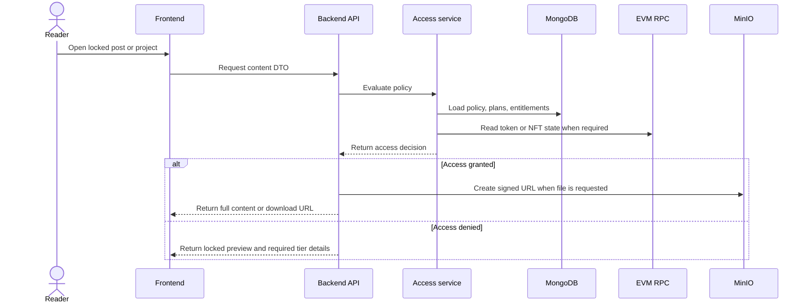

# Access Control

Access control is policy-based. Authors create reusable access policies and attach them to posts or projects. A policy can be public, a single condition, an AND group, or an OR group.

## Access policy flow

## Why backend verification is required

The frontend can hide locked content, but it is not a security boundary. The backend must evaluate every protected request because direct API calls or modified clients could otherwise bypass UI-only checks.

The access context includes:

- authenticated wallet address;
- active subscription entitlements;
- policy tree attached to the content;
- token balance or NFT ownership checks;
- content status and author ownership.

## Policy examples

| Mode | Meaning |
| --- | --- |
| Public | Content is visible without wallet access checks. |
| Single | One condition must be satisfied. |
| AND | All child conditions must be satisfied. |
| OR | At least one child condition must be satisfied. |

