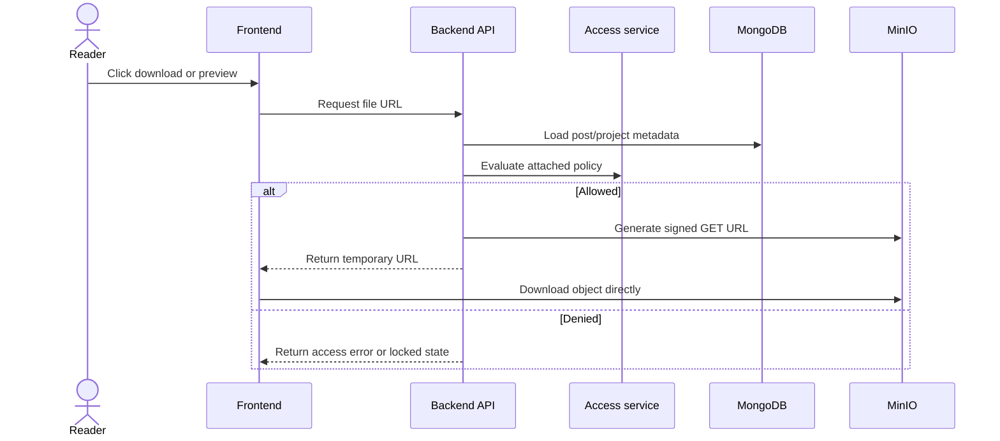
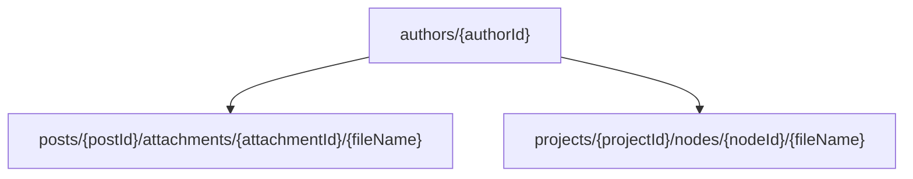
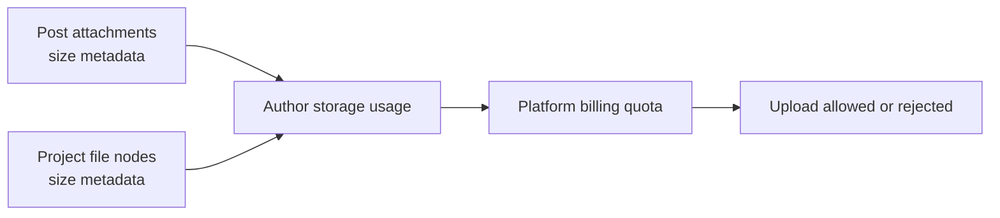

# Content Delivery

MongoDB stores metadata. MinIO stores binary objects. The backend links both layers through object keys and signed URLs.

## Signed URL flow

## Storage key layout

This layout keeps objects scoped by author and content type. It also makes storage accounting possible because post attachments and project file nodes are tracked with byte sizes in MongoDB.

## Storage accounting

The backend does not scan MinIO on every request to calculate usage. Instead, file size metadata is stored with post attachments and project nodes. This keeps quota checks fast and makes cleanup rules predictable.
