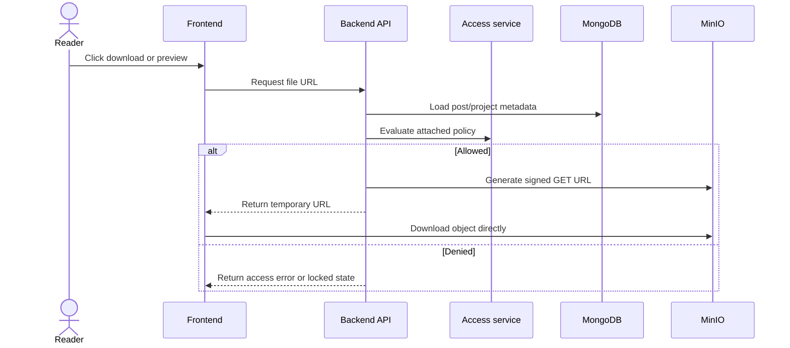
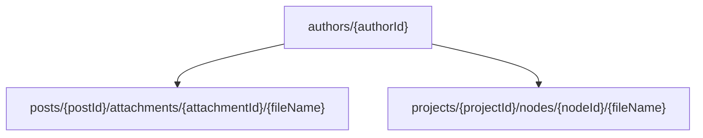
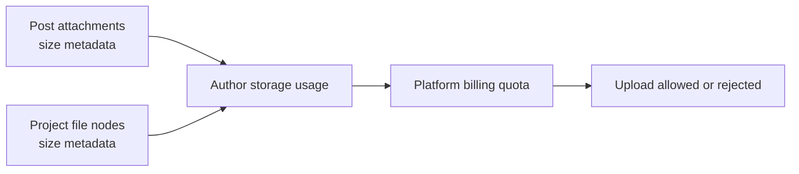

# Content Delivery

MongoDB stores metadata. MinIO stores binary objects. The backend links both layers through object keys and signed URLs.

The delivery model is intentionally not “serve every byte through the API”. The backend performs authorization and URL creation, then the browser downloads from object storage through a temporary URL. This keeps access control centralized while avoiding heavy file-transfer load on the API process.

## Signed URL flow

The signed URL is a short-lived capability, not a permanent public link. If a reader loses access later, the backend simply stops issuing new URLs. Existing URLs expire naturally.

## Storage key layout

This layout keeps objects scoped by author and content type. It also makes storage accounting possible because post attachments and project file nodes are tracked with byte sizes in MongoDB.

## Storage accounting

The backend does not scan MinIO on every request to calculate usage. Instead, file size metadata is stored with post attachments and project nodes. This keeps quota checks fast and makes cleanup rules predictable.

## Preview and download behavior

The same access decision protects previews, single-file downloads, folder bundles and bulk downloads. The frontend can render media players for supported files, but every protected byte still starts with a backend request. Unsupported previews fall back to a download action instead of exposing raw object keys.

## Why object keys are internal

Object keys use internal identifiers such as author id, post id, project id and node id. They do not depend on slugs, project titles or filenames alone. This prevents rename operations from becoming storage migrations and keeps cleanup deterministic.
