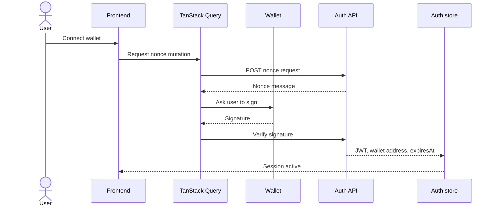
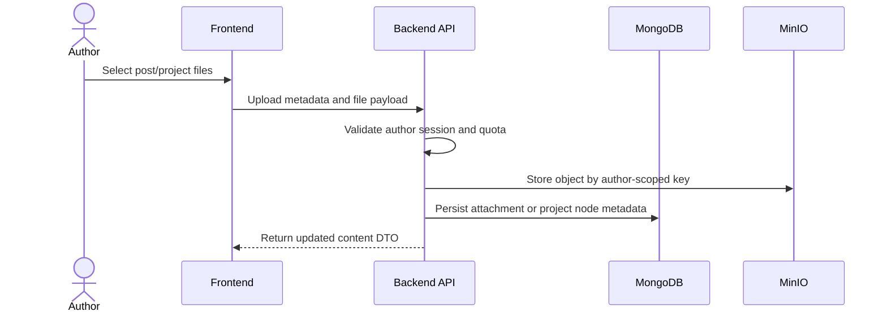
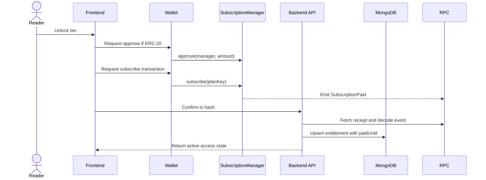
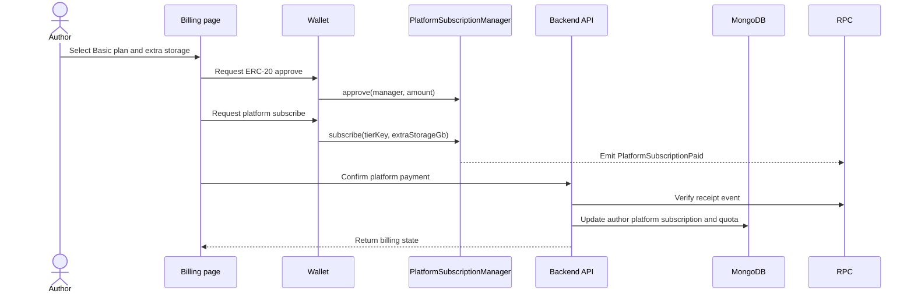

# Core Flows

This section summarizes the main runtime flows that connect frontend, backend, object storage and smart contracts.

## Wallet authentication flow

## File upload flow

The upload flow is intentionally backend-mediated. The frontend does not write directly into MinIO because quota checks, author ownership and project/post metadata must be committed consistently.

## Reader subscription flow

TanStack Query invalidates author tiers, posts, projects and reader subscription state after confirmation. This keeps the UI in sync without requiring a full page reload.

## Author platform billing flow

Author platform billing uses a different manager contract because the money flow is author-to-platform, not reader-to-author. The backend updates quota and feature availability after receipt verification.
