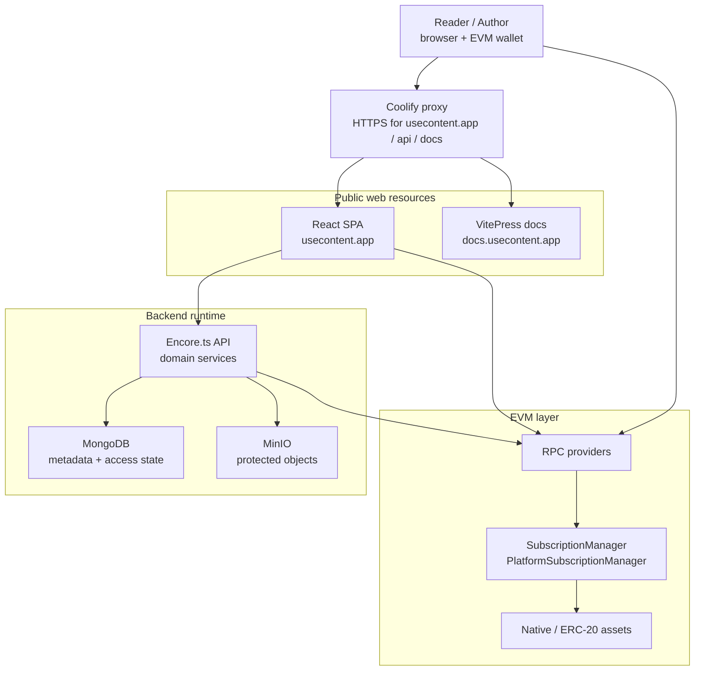

# High-Level Architecture

useContent is organized around a static frontend, an Encore.ts backend, MongoDB metadata, MinIO object storage and EVM smart contracts. Production traffic enters through the Coolify proxy, which terminates HTTPS for `usecontent.app`, `api.usecontent.app` and `docs.usecontent.app`. The backend is the security boundary for protected content: it verifies sessions, evaluates access policies, confirms blockchain events and issues signed file URLs only when access is valid.

## Production entry points

The public system has three entry points. `usecontent.app` serves the React application, `api.usecontent.app` receives browser API calls, and `docs.usecontent.app` serves the documentation portal. All three domains terminate TLS at the Coolify proxy, so application containers do not store certificate files and do not need to bind public HTTPS ports themselves.

The frontend still talks to the backend as a separate origin. That keeps the deployment explicit: CORS allows the production application origin, while the API can remain independently routed, logged and restarted.

## Service boundaries

The backend is split into domain services: profiles, access, subscriptions, platform billing, posts, projects, activity, authentication, storage and on-chain helpers. This keeps the access model, payment confirmation and file tree logic separated instead of centralizing all behavior in a single content module.

## Runtime responsibility map

| Area | Owner in the system | Why |
| --- | --- | --- |
| Session state | Frontend + auth service | Frontend stores the JWT metadata, backend verifies the token. |
| Access decisions | Backend access layer | The frontend cannot be trusted to protect data by itself. |
| Payment execution | Wallet + smart contract | The user signs transactions and the contract enforces payment logic. |
| Payment confirmation | Backend on-chain layer | Receipts and events are decoded through RPC before MongoDB state changes. |
| File bytes | MinIO | Binary objects are kept outside MongoDB. |
| File visibility | Backend + signed URLs | A MinIO object is only exposed after access evaluation. |

## Why the architecture is hybrid

The platform deliberately avoids putting content metadata and files on-chain. Blockchain operations are used where they add strong payment proof: subscriptions, paid-until extension and treasury transfers. Product behavior such as feeds, comments, access policy composition, file trees and activity remains in the backend/database layer, where it can evolve without contract migrations.
