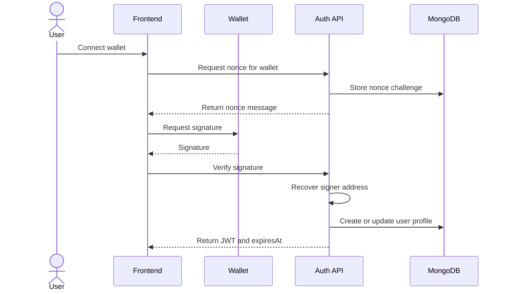
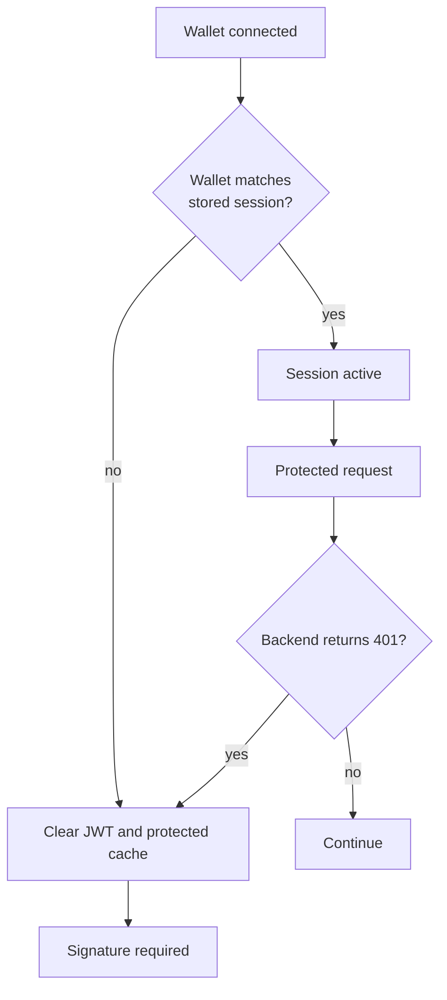

# Wallet Authentication

useContent authenticates users through wallet signatures. The wallet proves ownership of an address by signing a backend nonce. The backend then issues a JWT session.

The frontend stores session metadata: token, wallet address, authentication time and expiration time. If the connected wallet changes or the token expires, the session is cleared and the user must sign a new nonce.

## Session lifetime

The JWT session is intentionally time-limited. A persisted wallet connection is not treated as a valid application session by itself: the frontend checks the stored `expiresAt` value on startup and asks for a new signature when the session is stale.

This keeps the UX wallet-native without adding refresh tokens. The user signs a nonce again when the session expires, disconnects, switches accounts or receives an unauthenticated backend response.

## Account switching

The frontend keeps public pages available after session reset. Only protected mutations and private workspace data require signing again.
