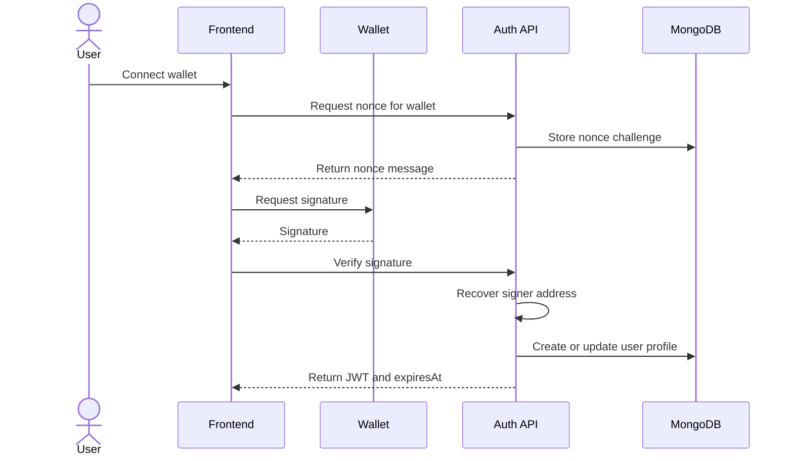

# Wallet Authentication

useContent authenticates users through wallet signatures. The wallet proves ownership of an address by signing a backend nonce. The backend then issues a JWT session.

The frontend stores session metadata: token, wallet address, authentication time and expiration time. If the connected wallet changes or the token expires, the session is cleared and the user must sign a new nonce.

