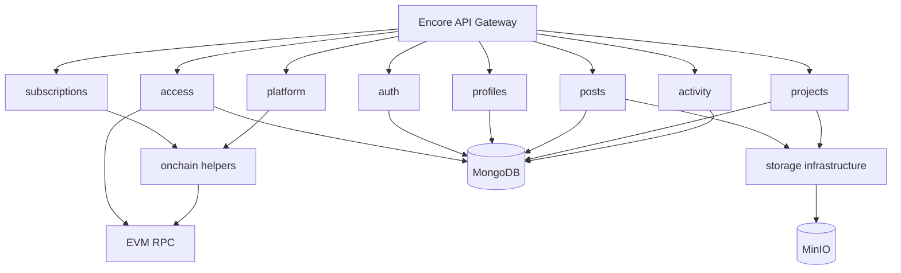

# Backend Architecture

The backend is implemented with Encore.ts and TypeScript. It exposes domain-oriented API services and integrates MongoDB, MinIO and EVM RPC providers.

## Domain services

| Service | Responsibility |
| --- | --- |
| auth | Nonce creation, signature verification, JWT validation. |
| profiles | Reader and author profile management. |
| access | Access policy CRUD and policy evaluation support. |
| subscriptions | Reader-to-author plans, entitlements and payment confirmation. |
| platform | Author platform billing, quotas and plan features. |
| posts | Posts, attachments, likes, comments, reports and feed responses. |
| projects | Project metadata, folder/file tree and project downloads. |
| activity | Lightweight activity records for user-facing notifications. |
| storage | Shared object storage infrastructure for MinIO. |
| onchain | RPC providers, ABI decoding and contract receipt verification. |

## Error handling

Backend services return domain-specific API errors such as unauthenticated, invalid argument, not found and failed precondition. The frontend normalizes those errors into inline states, toasts or form validation messages depending on context.

