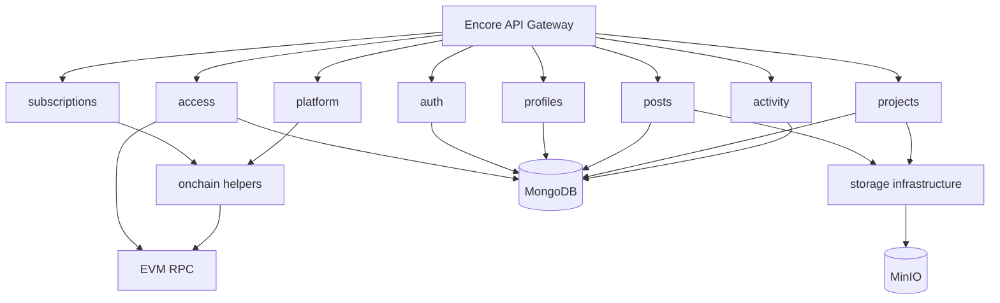

# Backend Architecture

The backend is implemented with Encore.ts and TypeScript. It exposes domain-oriented API services and integrates MongoDB, MinIO and EVM RPC providers.

## Domain services

| Service | Responsibility |
| --- | --- |
| auth | Nonce creation, signature verification, JWT validation. |
| profiles | Reader and author profile management. |
| access | Access policy CRUD and policy evaluation support. |
| subscriptions | Reader-to-author plans, entitlements and payment confirmation. |
| platform | Author platform billing, quotas and plan features. |
| posts | Posts, attachments, likes, comments, reports and feed responses. |
| projects | Project metadata, folder/file tree and project downloads. |
| activity | Lightweight activity records for user-facing notifications. |
| storage | Shared object storage infrastructure for MinIO. |
| onchain | RPC providers, ABI decoding and contract receipt verification. |

## Error handling

Backend services return domain-specific API errors such as unauthenticated, invalid argument, not found and failed precondition. Operational failure categories and request flow are described in [Backend Operations](./operations).

## Repository and storage boundaries

Domain services use repositories for MongoDB access and storage helpers for MinIO operations. File bytes are never treated as normal MongoDB fields. Instead, services persist object keys and file metadata, then call the storage layer when upload, download or cleanup operations are required.

## On-chain boundary

The backend does not send user transactions. Users sign transactions in the browser through their wallet. The backend only verifies receipts and decoded events. This keeps private wallet actions on the client side while still making payment state reliable for access checks.

## Runtime configuration

The backend receives runtime values through environment and Encore secrets:

- MongoDB URI;
- JWT secret;
- MinIO credentials;
- RPC URLs per chain;
- deployment registry token.

Contract deployment private keys are not part of the backend runtime configuration.

See [Backend Operations](./operations) for operational details.

## Service style

The backend modules follow the same pattern: API handlers stay thin, services own business rules, repositories own MongoDB access, and storage/on-chain helpers sit behind explicit domain boundaries. This structure keeps cross-cutting concerns visible without rebuilding a monolithic content service.
