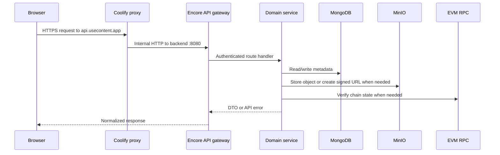
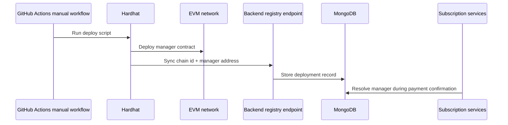
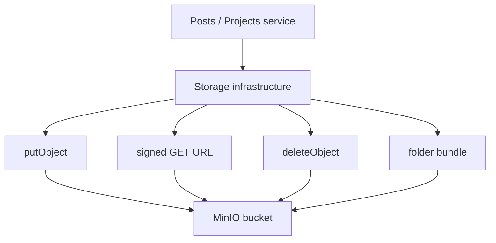

# Backend Operations

The backend is deployed as a Docker image built by GitHub Actions. Coolify runs that image behind the proxy together with MongoDB and MinIO. Operationally, the backend is responsible for request validation, domain orchestration, storage safety and on-chain event verification.

## Request flow

## Deployment registry flow

Reader and platform manager addresses are stored through a backend deployment registry. Hardhat deployment scripts sync contract addresses after a successful manual workflow. Runtime services then load manager addresses by chain instead of requiring hard-coded frontend constants.

## Object storage operations

MinIO is used through the backend storage layer. This gives the backend one place to manage object key generation, upload/delete calls, signed download URLs, folder bundle creation and storage cleanup support.

## Failure taxonomy

Backend failures are represented as API errors instead of leaking raw exceptions to the frontend.

| Failure | Typical response | UI behavior |
| --- | --- | --- |
| Expired session | `unauthenticated` | Clear session and ask for wallet signature. |
| Invalid form input | `invalid_argument` | Show field-level validation or inline message. |
| Missing author/content | `not_found` | Show empty or not-found state. |
| Missing plan/feature | `failed_precondition` | Show upgrade or plan-required state. |
| Storage quota exceeded | `failed_precondition` | Block upload and show quota message. |
| Contract verification failed | `invalid_argument` / `failed_precondition` | Keep access locked and show transaction error. |

The frontend then decides how to display those failures: inline query states for page loads, toasts for user actions and field errors for validation.

