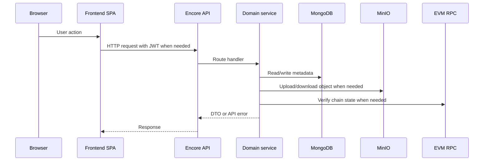

# Backend Operations

The backend is deployed as a Docker image built by GitHub Actions. Coolify pulls and runs that image with the rest of the runtime stack.

## Request path

## Deployment registry

Reader and platform manager addresses are stored through a backend deployment registry. Hardhat deployment scripts sync contract addresses after a successful manual workflow. Runtime services then load manager addresses by chain instead of requiring redeploy-time frontend constants.

## Object storage operations

MinIO is used through the backend storage layer. This gives the backend one place to manage:

- object key generation;
- upload and delete calls;
- signed download URLs;
- folder bundle creation;
- storage cleanup support.

## Failure handling

Important failure cases are represented as API errors rather than raw exceptions:

- unauthenticated session;
- missing author profile;
- invalid access policy input;
- missing contract deployment;
- failed transaction verification;
- storage quota exceeded;
- feature unavailable on the current platform plan.

