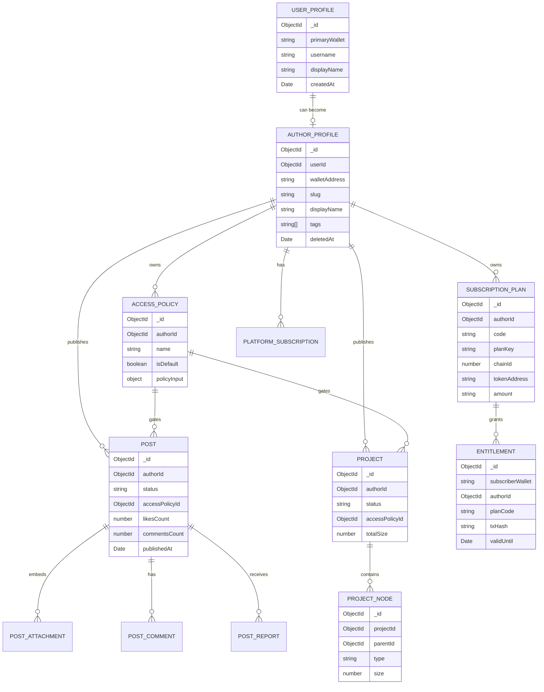
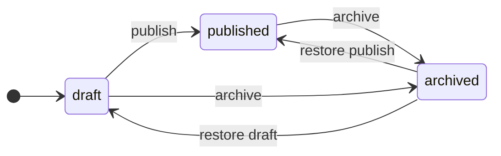

# Domain Model

The database model is centered around author-owned content, reusable access policies and subscription-derived entitlements.

## Separation of concerns

MongoDB contains documents and access state. MinIO contains the actual file bytes. Smart contracts contain payment state and emit events, but the backend mirrors successful payments into MongoDB entitlements for fast access evaluation.

For a deeper storage-focused view, see [Storage Model](./storage) and [MongoDB Collections](./mongodb).

## Content state model

Draft content is author-only. Published content can appear in feeds if the access policy allows it. Archived content is hidden from reader feeds and ordinary author lists.

## Entitlement model

Entitlements are the backend projection of successful reader subscription payments. The contract remains the payment source of truth, but the backend stores the access-friendly state:

- subscriber wallet;
- author;
- plan code and plan key;
- chain and transaction hash;
- valid-until date.

This lets access evaluation avoid scanning historical chain events on every content request.

## Platform billing model

Platform billing is author-facing. It tracks the current plan, storage quota, grace state and extra storage. Upload checks compare metadata-based usage with the current quota before accepting new files.
