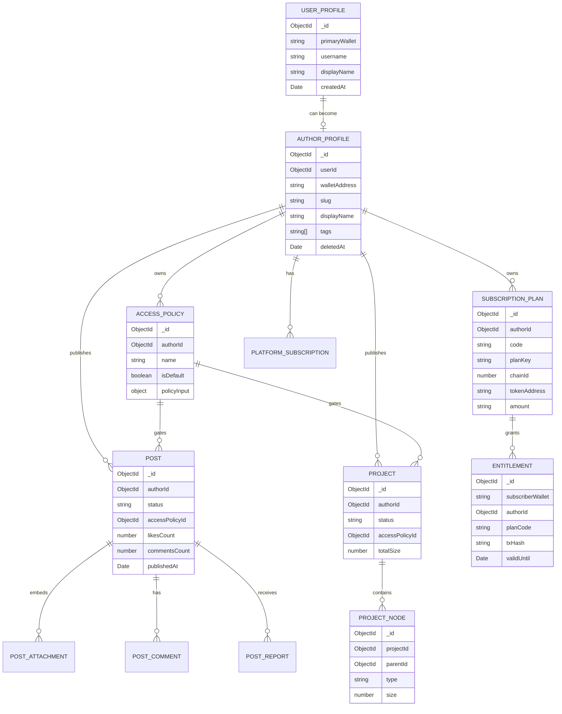

# Data Model

The database model is centered around author-owned content, reusable access policies and subscription-derived entitlements.

## Separation of concerns

MongoDB contains documents and access state. MinIO contains the actual file bytes. Smart contracts contain payment state and emit events, but the backend mirrors successful payments into MongoDB entitlements for fast access evaluation.

