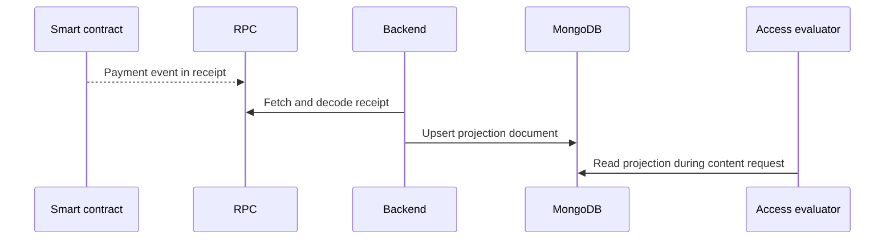

# MongoDB Collections

MongoDB is used as the operational projection of the platform. It stores product state that must be queried quickly: profiles, access policies, content metadata, subscriptions, billing, activity and moderation records.

## Collection groups

| Group | Documents | Purpose |
| --- | --- | --- |
| Identity | user profiles, author profiles | Wallet-linked identity and author public profile state. |
| Access | access policies, subscription plans, entitlements | Reusable access rules and backend access projections. |
| Content | posts, post attachments, comments, reports, projects, project nodes | Author-owned content and file tree metadata. |
| Billing | platform plans, author platform subscriptions, cleanup audit entries | Author-to-platform features, quotas and cleanup history. |
| Operations | contract deployments, activity records | Runtime contract lookup and lightweight notifications. |

## Why MongoDB fits this model

The product has nested documents and fast-changing product state: access policy trees, project folder nodes, activity entries, comments and attachment metadata. MongoDB keeps those records close to the shapes returned by the API while still allowing indexes for author feeds, published content, project nodes and active entitlements.

## Backend projection of blockchain state

Smart contracts emit payment events, but the backend stores the access-friendly result in MongoDB. For reader subscriptions this result is an entitlement with `validUntil`. For platform billing this result is the author billing state with enabled features, included storage and extra storage.

This avoids re-reading historical blockchain logs on every content request while still anchoring paid access in verified contract events.

