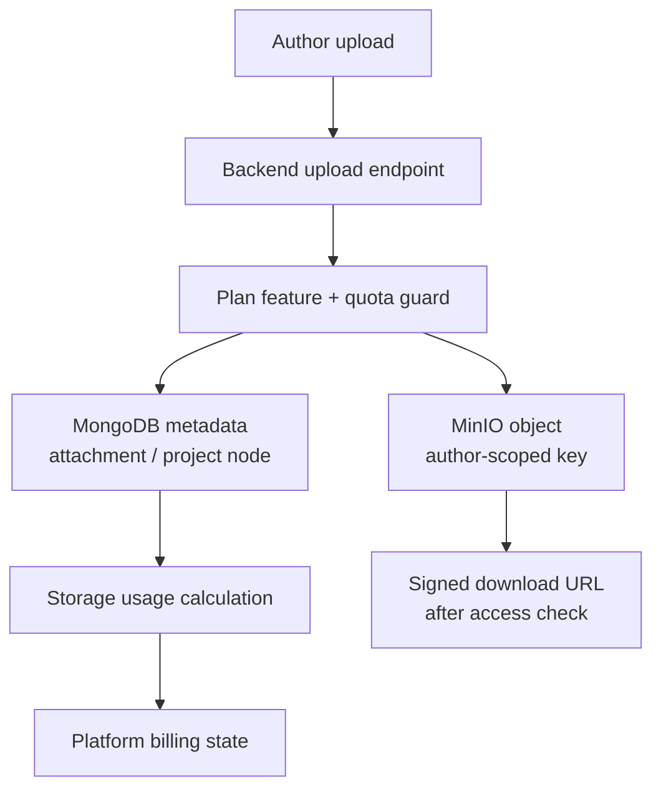
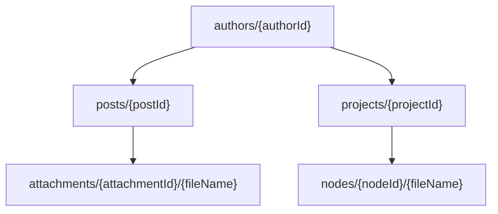

# Storage Model

Storage is split into metadata and binary objects. MongoDB stores content records, access state, file metadata and byte sizes. MinIO stores the actual bytes for post attachments and project files.

## Storage boundary

The backend is the only component that writes metadata and object keys. The frontend never writes directly to MinIO because it would bypass author ownership checks, quota enforcement and project tree consistency.

## Object key layout

The layout keeps objects grouped by author and content type. It is intentionally not based on public usernames or project names, because those values can change and should not become storage identifiers.

## Usage accounting

Storage usage is calculated from MongoDB metadata rather than by scanning MinIO on every request. Post attachments and project file nodes store their byte size, so the platform can compute:

- bytes used by post attachments;
- bytes used by project files;
- total author usage;
- remaining quota for the active platform plan;
- cleanup candidates when an expired author remains over quota.

## Cleanup model

When a platform subscription expires, the system does not immediately delete projects or posts. The current model is softer: uploads are blocked during grace/expired states, and cleanup targets old file objects first when usage must return under the free quota. Post and project records remain as metadata shells, while removable file bytes are selected oldest-first.

