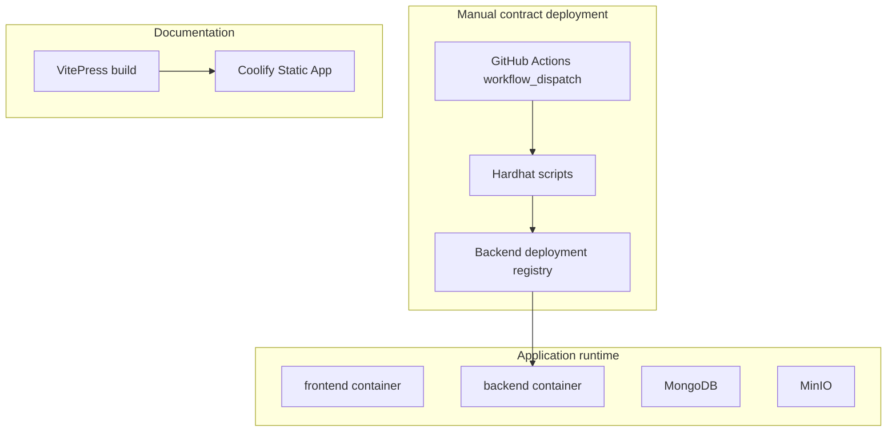

# Runtime Environments

The project separates three operational concerns: application runtime, contract deployment and documentation hosting.

## Environment map

## Environment variables

Application runtime needs API, database, object storage and RPC configuration. Contract deployment additionally needs deployer private keys and platform treasury values. Documentation deployment does not need application secrets.

| Environment | Needs secrets | Notes |
| --- | --- | --- |
| Frontend runtime build | Public API/RPC values | Values are baked into the static SPA build. |
| Backend runtime | MongoDB, JWT, MinIO, RPC, registry token | Runs in Coolify containers. |
| Contract deployment | Deployer key, treasury, RPC, registry token | Runs only in manual GitHub Actions workflows. |
| Documentation static app | No | Builds Markdown/VitePress only. |

## Domain layout

The intended public layout is:

- `app.domain.com` for the main useContent application;
- `docs.domain.com` for the VitePress documentation portal.

Keeping the domains separate avoids coupling documentation deploys to application releases.

