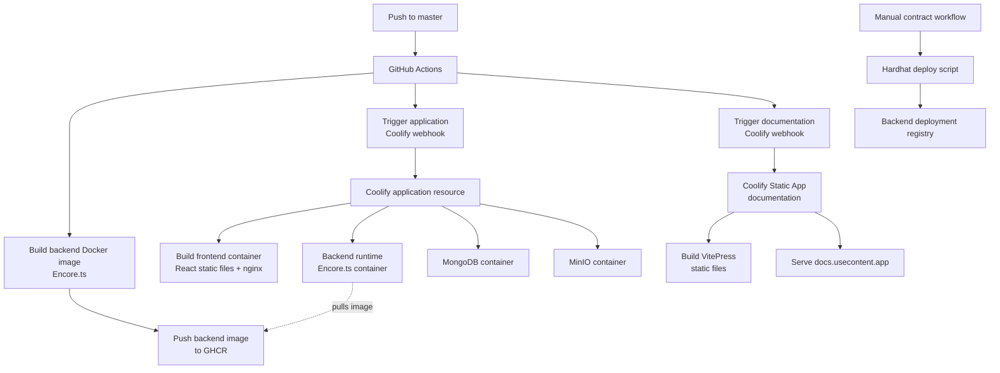
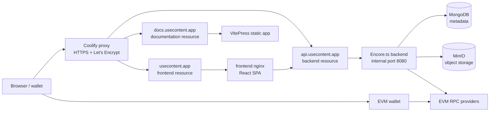
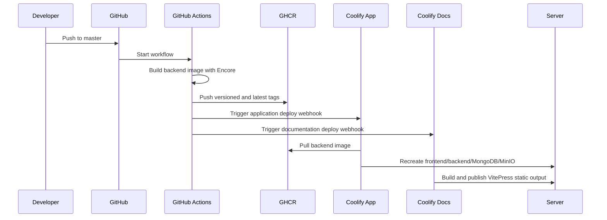

# Deployment

The production setup is hosted behind the Coolify proxy on the `usecontent.app` domain. The main application, backend API and documentation are deployed as separate Coolify resources, but they share the same server-level HTTPS entry point.

    <a class="doc-card" href="#application-deployment">
        Runtime
        <strong>Application stack</strong>
        Frontend nginx container, backend image, MongoDB and MinIO.
    </a>
    <a class="doc-card" href="#contract-deployment">
        Contracts
        <strong>Manual workflows</strong>
        Hardhat deployment jobs with private keys scoped to GitHub Actions.
    </a>
    <a class="doc-card" href="/deployment/documentation">
        Docs
        <strong>Static VitePress</strong>
        Coolify Static App with no Dockerfile and no runtime secrets.
    </a>

## Runtime routing

## Application deployment

The frontend is built into a static bundle and served through nginx on `https://usecontent.app`. The backend is built as a Docker image through GitHub Actions and pushed to GitHub Container Registry. Coolify pulls and runs that image as the API resource for `https://api.usecontent.app`.

The backend listens on port `8080` inside the Docker network, but it is not published directly on the host. Public HTTPS traffic reaches it through the Coolify proxy.

This separation keeps the runtime predictable: the frontend can be rebuilt by Coolify from the repository, while the backend image is produced by the CI workflow that already knows how to run the Encore Docker build. The public API origin stays stable as `https://api.usecontent.app`, so the browser never talks to the raw server IP or a host port. CORS is intentionally narrow: credentialed requests are accepted from `https://usecontent.app`, not from wildcard origins.

The proxy is also responsible for TLS certificates. Once DNS records point `usecontent.app`, `api.usecontent.app` and `docs.usecontent.app` to the server, Coolify can terminate HTTPS and route traffic to the correct internal resource. This keeps certificates out of the frontend nginx config and out of the backend container.

## Runtime containers

| Container | Role |
| --- | --- |
| frontend | Builds React/Vite output and serves it through nginx. |
| backend | Runs the Encore API image from GitHub Container Registry and receives traffic through `api.usecontent.app`. |
| mongo | Stores application metadata and access state. |
| minio | Stores binary objects for posts and projects. |
| minio-init | Creates the required bucket during startup. |

<strong>Deployment boundary.</strong> Runtime containers receive only application runtime configuration. Contract deployment secrets live in manual GitHub Actions workflows, not in Coolify containers.

## CI/CD flow

The frontend is built by Coolify from the repository using the frontend Dockerfile. The backend is prebuilt in GitHub Actions because the Encore Docker build is part of the CI workflow. Documentation is built by a separate Coolify Static App from the `documentation` directory.

## Contract deployment

Smart contract deployment is manual. GitHub Actions workflows run Hardhat deployment scripts for selected networks and sync deployed manager addresses into the backend deployment registry.

Manual workflows are used because contract deployment requires private keys and RPC endpoints. Those secrets should be scoped to GitHub Actions and not mounted into the runtime backend or frontend containers.

## Documentation deployment

The VitePress documentation is deployed as a separate Coolify Static App on `https://docs.usecontent.app`. It does not require Dockerfile or docker-compose configuration.

See [Documentation Deployment](./documentation) for exact Coolify settings.
