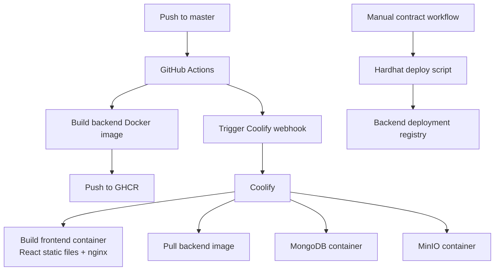

# Deployment

The runtime application and the documentation portal are deployed separately.

## Application deployment

The frontend is built into a static bundle and served through nginx. The backend is built as a Docker image through GitHub Actions and pushed to GitHub Container Registry. Coolify pulls and runs the backend image together with MongoDB and MinIO.

## Contract deployment

Smart contract deployment is manual. GitHub Actions workflows run Hardhat deployment scripts for selected networks and sync deployed manager addresses into the backend deployment registry.

## Documentation deployment

The VitePress documentation is deployed as a separate Coolify Static App. It does not require Dockerfile or docker-compose configuration.

