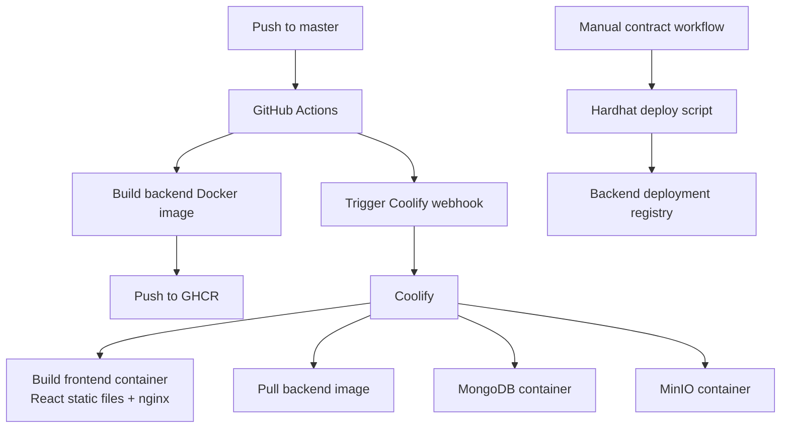
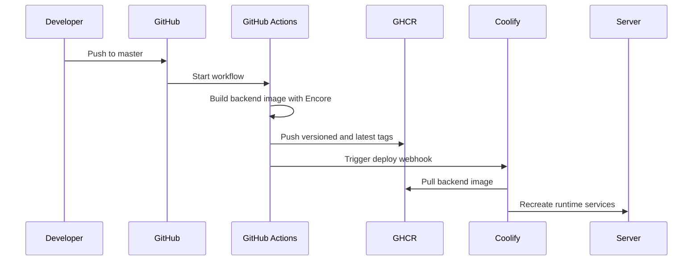

# Deployment

The runtime application and the documentation portal are deployed separately.

    <a class="doc-card" href="#application-deployment">
        Runtime
        <strong>Application stack</strong>
        Frontend nginx container, backend image, MongoDB and MinIO.
    </a>
    <a class="doc-card" href="#contract-deployment">
        Contracts
        <strong>Manual workflows</strong>
        Hardhat deployment jobs with private keys scoped to GitHub Actions.
    </a>
    <a class="doc-card" href="/deployment/documentation">
        Docs
        <strong>Static VitePress</strong>
        Coolify Static App with no Dockerfile and no runtime secrets.
    </a>

## Application deployment

The frontend is built into a static bundle and served through nginx. The backend is built as a Docker image through GitHub Actions and pushed to GitHub Container Registry. Coolify pulls and runs the backend image together with MongoDB and MinIO.

## Runtime containers

| Container | Role |
| --- | --- |
| frontend | Builds React/Vite output and serves it through nginx. |
| backend | Runs the Encore API image from GitHub Container Registry. |
| mongo | Stores application metadata and access state. |
| minio | Stores binary objects for posts and projects. |
| minio-init | Creates the required bucket during startup. |

<strong>Deployment boundary.</strong> Runtime containers receive only application runtime configuration. Contract deployment secrets live in manual GitHub Actions workflows, not in Coolify containers.

## CI/CD flow

The frontend is built by Coolify from the repository using the frontend Dockerfile. The backend is prebuilt in GitHub Actions because the Encore Docker build is part of the CI workflow.

## Contract deployment

Smart contract deployment is manual. GitHub Actions workflows run Hardhat deployment scripts for selected networks and sync deployed manager addresses into the backend deployment registry.

Manual workflows are used because contract deployment requires private keys and RPC endpoints. Those secrets should be scoped to GitHub Actions and not mounted into the runtime backend or frontend containers.

## Documentation deployment

The VitePress documentation is deployed as a separate Coolify Static App. It does not require Dockerfile or docker-compose configuration.

See [Documentation Deployment](./documentation) for exact Coolify settings.
