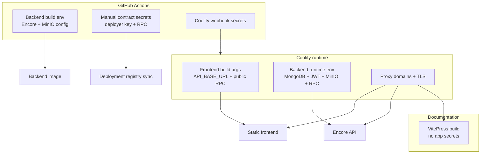

# Secrets & Environments

The project separates build-time values, runtime secrets and manual contract deployment secrets. This avoids putting deployer private keys into application containers and keeps public frontend values explicit.

## Environment map

## Build-time values

Frontend values are baked into the static SPA during build. The most important production value is `API_BASE_URL=https://api.usecontent.app`. Public RPC URLs can also be provided for frontend wallet reads, but private keys are never needed by the frontend build.

Backend image build is handled by GitHub Actions. The workflow injects MinIO-related build configuration for Encore Docker build and then pushes the image to GHCR.

## Runtime values

| Runtime area | Values |
| --- | --- |
| Backend API | `MONGO_URI`, `JWT_SECRET`, MinIO credentials, RPC URLs, deployment registry token |
| Frontend container | Static files and public build-time config |
| MongoDB | Persistent metadata volume |
| MinIO | Persistent object storage volume and root credentials |
| Coolify proxy | Domains, routing labels and TLS certificates |

## Contract deployment secrets

Contract deployment is intentionally separate from normal application deployment. Manual GitHub Actions workflows receive deployer private keys, treasury addresses, RPC URLs and registry token only for the duration of the deployment job. Runtime containers only read the resulting deployment registry records.

## Domain layout

- `https://usecontent.app` for the main useContent frontend;
- `https://api.usecontent.app` for frontend-to-backend API traffic;
- `https://docs.usecontent.app` for the VitePress documentation portal.

Keeping these origins explicit makes CORS, certificate routing and deployment ownership easier to reason about.

