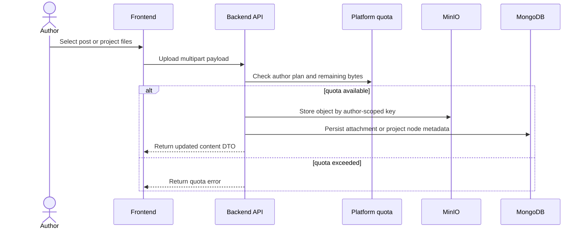
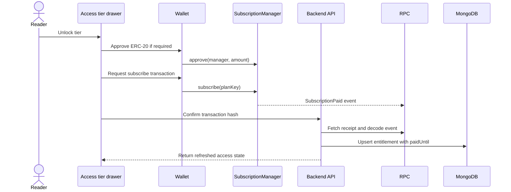
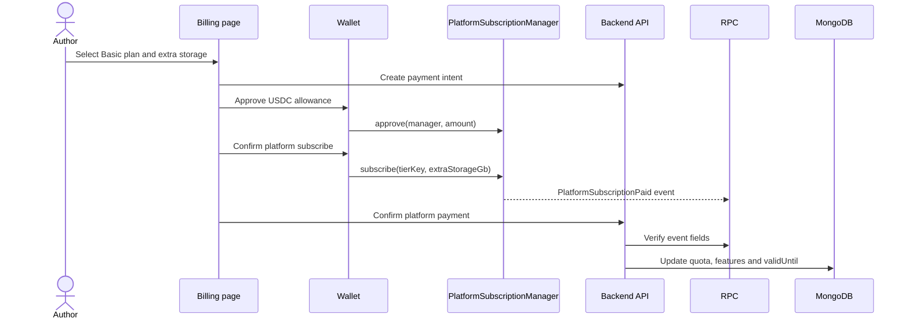
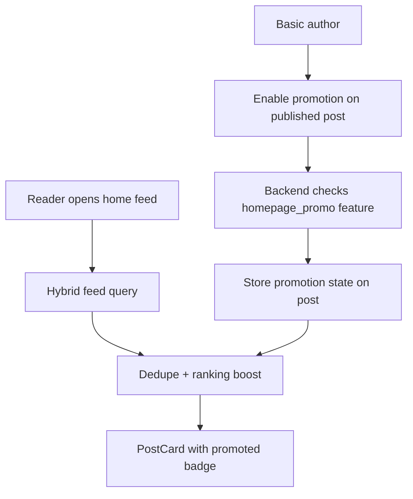

# Runtime Flows

Runtime flows describe how user actions cross the frontend, backend, object storage and smart contracts. Wallet login has a dedicated page, so this section focuses on the product flows that combine several subsystems.

<strong>Flow rule.</strong> The frontend initiates user interactions, but access decisions, storage commits and payment confirmation are finalized on the backend.

File upload flow

The upload path is backend-mediated because quota, author ownership, project tree consistency and object keys must be validated before bytes become visible to readers.

Reader subscription flow

The UI never treats a transaction hash as final access. The backend confirms the emitted event, validates the manager address, subscriber wallet, plan key and amount, and only then updates the entitlement projection in MongoDB.

Author platform billing flow

This flow is separate from reader subscriptions because the payer, receiver and backend projection are different. Reader payments create entitlements; author platform billing changes storage quota and feature gates.

Promoted feed flow

Promotion is currently a platform-plan feature, not a separate advertising auction. The backend still keeps it explicit so it can later evolve into slots, budgets or moderation workflows.

