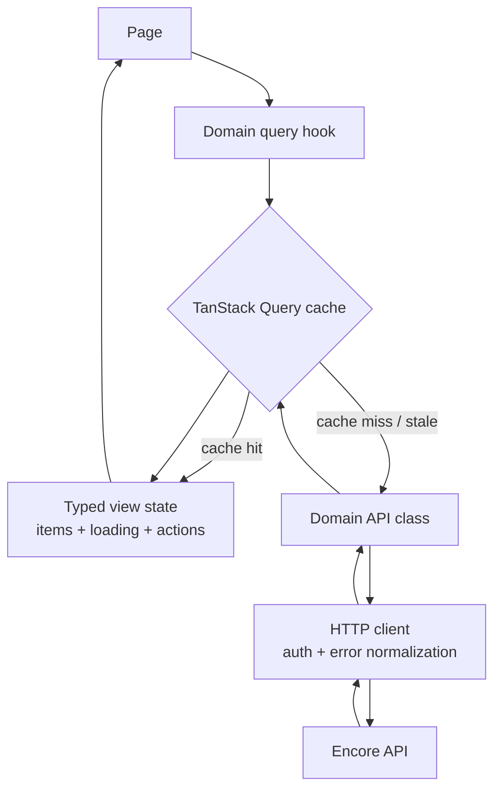
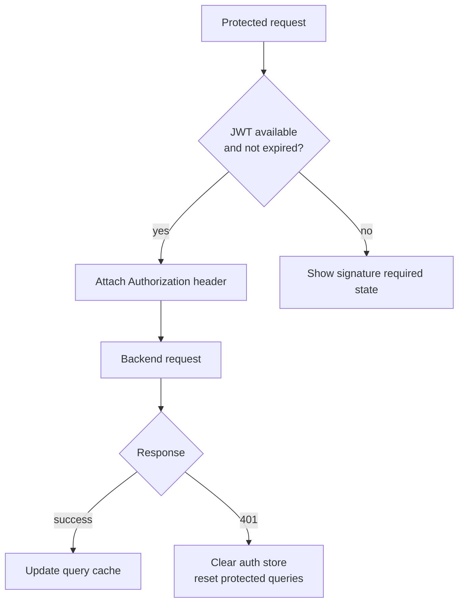
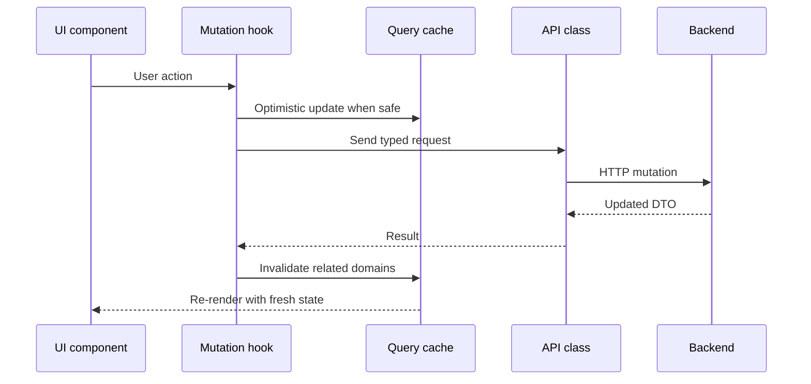
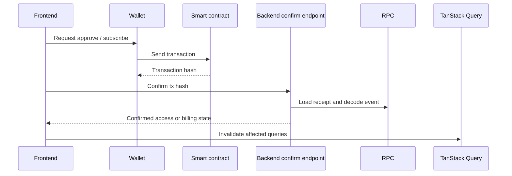

# Frontend Data Flow

The frontend is a static React application, but most screens depend on server state: feeds, access tiers, billing state, comments, project trees and session-aware user data. The data flow is built around small domain hooks instead of direct Axios calls from pages.

    <a class="doc-card" href="#tanstack-query-lifecycle">
        Cache
        <strong>TanStack Query</strong>
        Owns server state, pagination, loading states and refetch behavior.
    </a>
    <a class="doc-card" href="#typed-api-layer">
        HTTP
        <strong>Typed API layer</strong>
        Keeps pages away from raw Axios calls and response object shapes.
    </a>
    <a class="doc-card" href="#session-state">
        Session
        <strong>Auth store</strong>
        Tracks wallet address, JWT token and expiration metadata.
    </a>

## TanStack Query lifecycle

Pages consume already-shaped hooks such as feed items, loading flags, pagination helpers and mutation actions. This keeps page components focused on layout instead of response parsing.

## Typed API layer

The API layer wraps Axios with typed helpers for `GET`, `POST`, `PATCH`, uploads and downloads. Query params are serialized centrally, so API classes do not repeat `undefined` checks or inline response wrappers. Shared DTOs define the API contract, while frontend-only types describe local filters, tabs and form state.

## Session state

Protected requests attach the current JWT. The auth store also keeps the connected wallet address, `authenticatedAt` and `expiresAt`. If a request returns `401`, the HTTP layer clears the session and protected query cache while keeping public pages usable.

## Mutation invalidation

This pattern is used for likes, comments, post archive/restore, subscription confirmation, author profile updates, reports and platform billing updates.

## Web3 request flow

Web3 operations combine wallet state, contract writes and backend confirmation. The frontend can request a transaction, but access is updated only after the backend verifies the event through RPC.

The same shape is used for reader subscriptions and author platform billing, but the backend validates different manager contracts and updates different MongoDB projections.
