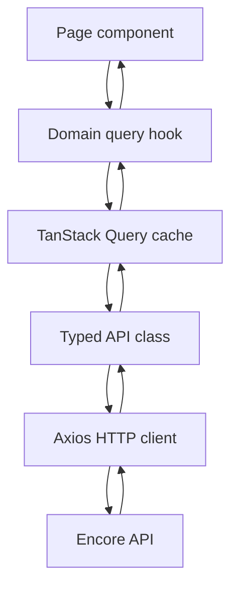
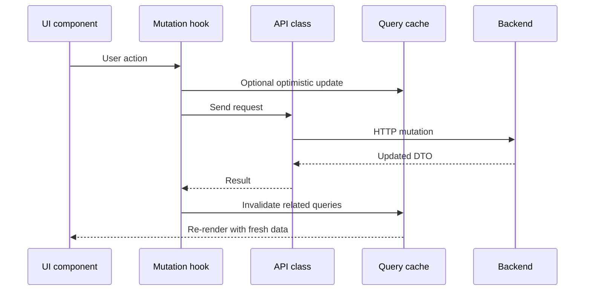

# Frontend Data Flow

The frontend is a static React application, but most screens depend on server state. TanStack Query is the main coordination layer between UI components, API classes and backend responses.

    

        Cache
        <strong>TanStack Query</strong>
        Owns server state, pagination, loading states and refetch behavior.
    

    

        HTTP
        <strong>Typed API layer</strong>
        Keeps pages away from raw Axios calls and response object shapes.
    

    

        Session
        <strong>Auth store</strong>
        Tracks wallet address, JWT token and expiration metadata.
    

Query lifecycle

Pages do not call Axios directly. They use domain query hooks that return already shaped data such as feed items, loading states, pagination helpers and mutation actions.

Mutation and invalidation

This pattern is used for actions such as likes, comments, post archive/restore, subscription confirmation, author profile updates and billing updates.

## Session-aware requests

The Axios layer attaches the current JWT when a protected request is made. If the backend returns an unauthenticated response, the frontend clears the stored session and keeps public pages usable. This prevents the UI from showing an old wallet session as active after the token expires.

Web3 request flow

Web3 operations are not treated as normal HTTP requests. The frontend first uses wagmi/viem to read wallet, chain and contract state. Once a transaction is confirmed by the wallet, the backend receives the transaction hash and validates the event through RPC.

```mermaid
flowchart LR
    UI["Subscribe button"] --> Wallet["Wallet confirmation"]
    Wallet --> Contract["Smart contract transaction"]
    Contract --> TxHash["Transaction hash"]
    TxHash --> Backend["Backend confirm endpoint"]
    Backend --> RPC["RPC receipt lookup"]
    RPC --> Event["Decoded event"]
    Event --> Cache["Invalidate query cache"]
```

The UI does not assume that a transaction hash is enough. Access is updated only after backend confirmation succeeds.

