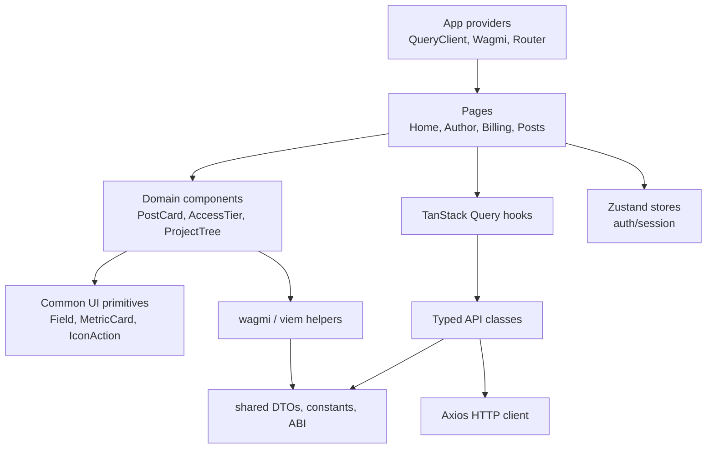

# Frontend Architecture

The frontend is a React SPA built with Vite. It is served as static files and communicates with the backend through typed API classes.

## State management

Server state is handled by TanStack Query. Local session state is stored in Zustand. Component-local form state is kept in React components and custom hooks unless it must be shared globally.

| State type | Tool | Examples |
| --- | --- | --- |
| Server cache | TanStack Query | feeds, author profiles, access tiers, billing state, activity |
| Mutations | TanStack Query | sign in, create post, subscribe, upload file, archive post |
| Wallet/session state | Zustand + wagmi | JWT metadata, wallet address, connection state |
| Form state | React hooks + validation schemas | onboarding, access policy editor, post composer |
| Derived display state | Pure utilities | prices, dates, file sizes, explorer links |

## API layer

The API layer wraps Axios and returns typed DTOs. Request params and response shapes are centralized to avoid inline object contracts inside pages.

## Web3 integration

wagmi and viem are used for:

- wallet connection;
- contract reads;
- ERC-20 allowance checks;
- approve transactions;
- subscription transactions;
- transaction status handling.

## Page composition

The frontend avoids turning pages into large UI components. Pages usually coordinate queries, route state and high-level layout. Domain folders then render the actual interface:

- public author pages use access tier cards, tier drawers and post feed components;
- author workspace pages reuse content manager, post composer and project tree components;
- billing pages use storage/quota panels and checkout drawers;
- feed pages reuse the same post card structure across home, subscription feed and author pages.

This structure makes it possible to change cards, fields or action buttons in one place instead of editing similar markup across many pages.

## UI structure

Large pages are decomposed into page-specific component folders. Shared visual primitives live in `components/common`, while domain-specific components stay close to their domain folders.

See [Frontend Data Flow](./data-flow) for the detailed request/cache/mutation flow.

