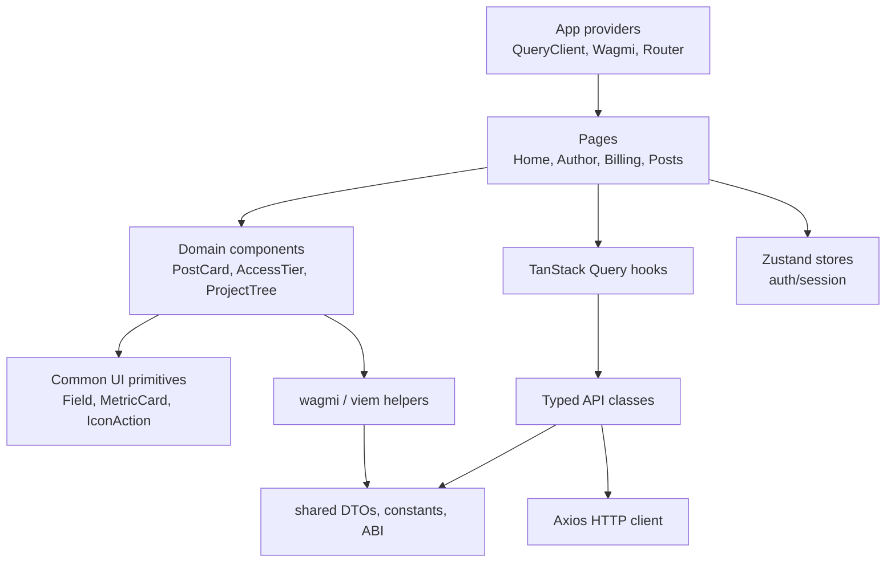

# Frontend Architecture

The frontend is a React SPA built with Vite. It is served as static files and communicates with the backend through typed API classes.

## State management

Server state is handled by TanStack Query. Local session state is stored in Zustand. Component-local form state is kept in React components and custom hooks unless it must be shared globally.

## API layer

The API layer wraps Axios and returns typed DTOs. Request params and response shapes are centralized to avoid inline object contracts inside pages.

## Web3 integration

wagmi and viem are used for:

- wallet connection;
- contract reads;
- ERC-20 allowance checks;
- approve transactions;
- subscription transactions;
- transaction status handling.

## UI structure

Large pages are decomposed into page-specific component folders. Shared visual primitives live in `components/common`, while domain-specific components stay close to their domain folders.

