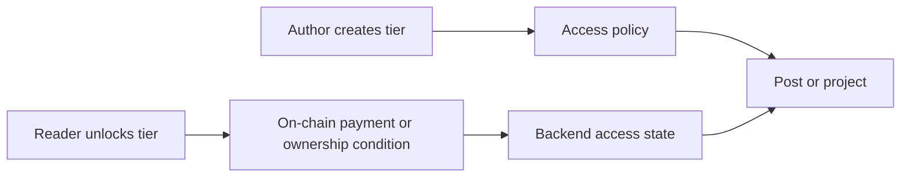

# Introduction

useContent is a wallet-native content platform where creators publish posts and projects, define access rules, and monetize access through on-chain subscriptions. Readers connect a wallet, unlock access tiers, and view protected content when the backend confirms that the required conditions are satisfied.

The platform combines traditional web application components with blockchain-based payment verification:

- a React SPA for author and reader workspaces;
- an Encore.ts backend split into domain services;
- MongoDB for metadata and access state;
- MinIO for binary objects such as post attachments and project files;
- EVM smart contracts for subscription payments and platform billing;
- Coolify and GitHub Actions for deployment operations.

## Primary actors

| Actor | Responsibility |
| --- | --- |
| Reader | Connects a wallet, signs in, subscribes to authors, unlocks tiers, reads posts and downloads allowed project files. |
| Author | Creates an author profile, publishes posts/projects, defines access policies, manages subscribers and platform billing. |
| Platform owner | Receives platform fees, deploys manager contracts, operates infrastructure and platform-level billing. |

## Product boundary

useContent does not store private content on-chain. Smart contracts handle payment and subscription validity, while the backend remains responsible for access verification, metadata, object storage and signed URL generation.

<strong>Engineering focus.</strong> The system is designed as a hybrid Web2/Web3 platform: blockchain is used for payment proof and subscription state, while the backend handles product data, file protection and user-facing access decisions.

## Main product loop

The important part is that a subscription plan is not the final product object visible to the reader. The reader sees an access tier, and the tier may include a subscription condition, token ownership, NFT ownership or a combination of rules.
