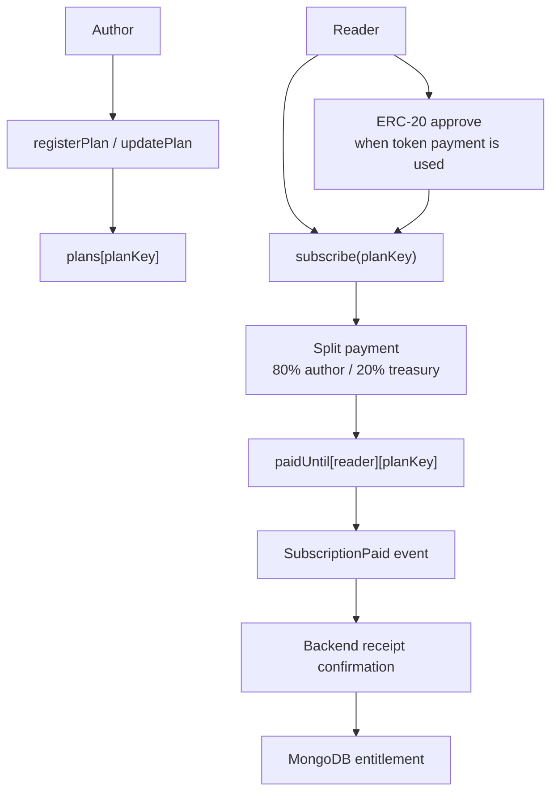
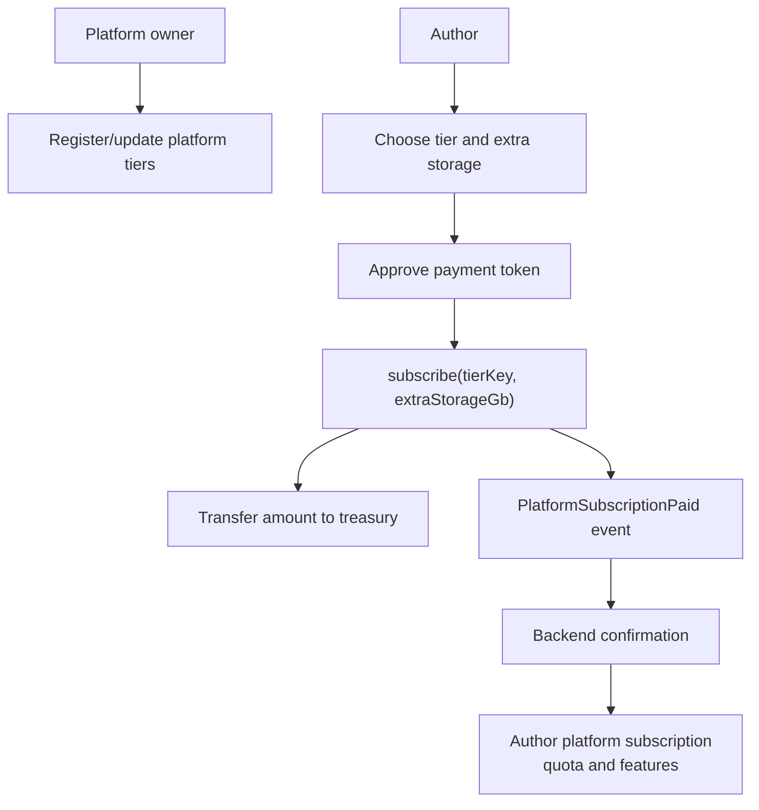

# Smart Contracts

useContent uses two smart contract managers:

- `SubscriptionManager` for reader-to-author subscriptions;
- `PlatformSubscriptionManager` for author-to-platform billing and storage quota payments.

## SubscriptionManager

The contract supports native token payments and ERC-20 payments. For ERC-20 plans, the reader approves the manager contract before calling `subscribe`. For native token plans, the reader sends `msg.value` with the subscription transaction.

## PlatformSubscriptionManager

This contract does not split revenue with creators. It represents author-to-platform billing: plan tier, extra storage and paid-until state.

## Deployment

Contracts are deployed through manual GitHub Actions workflows. This keeps private deploy keys and RPC configuration outside runtime application containers.

