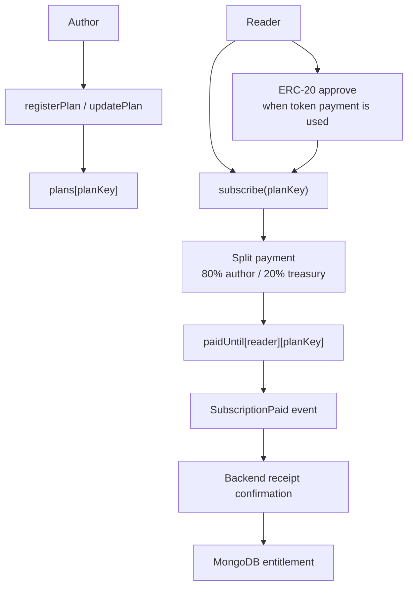
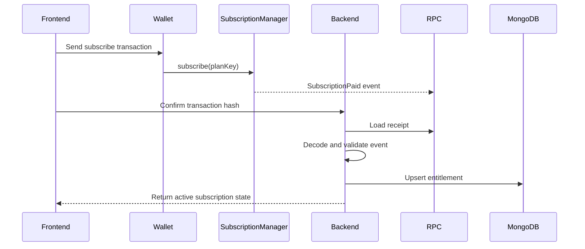
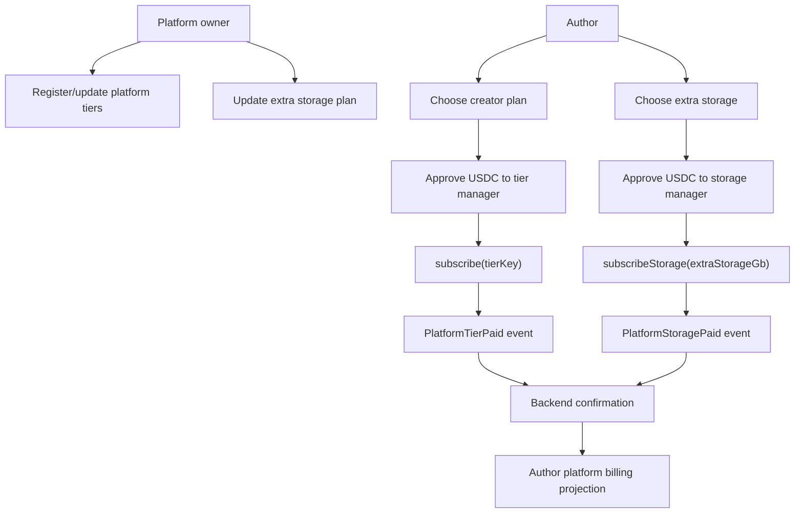

# Smart Contracts

useContent uses two smart contract managers:

- `SubscriptionManager` for reader-to-author subscriptions;
- `PlatformTierManager` for author-to-platform creator plan payments;
- `PlatformStorageManager` for separate author extra storage payments.

Both contracts are deployed per supported EVM network and discovered by the backend through the deployment registry. Current runtime configuration includes test networks such as Sepolia, Base Sepolia, Optimism Sepolia and Arbitrum Sepolia, plus production-oriented chain ids for Base, Optimism and Arbitrum.

## SubscriptionManager

The contract supports native token payments and ERC-20 payments. For ERC-20 plans, the reader approves the manager contract before calling `subscribe`. For native token plans, the reader sends `msg.value` with the subscription transaction.

The important contract state is intentionally small: registered plans and `paidUntil` by subscriber and plan key. Rich product state such as comments, access policy names, tier descriptions and content metadata remains off-chain.

## Reader payment verification

The backend checks the manager address, subscriber wallet, plan key, token, amount and paid-until value before updating MongoDB.

## Platform Tier And Storage Managers

These contracts do not split revenue with creators. They represent author-to-platform billing only: the tier manager controls creator plan state, features and base storage; the storage manager controls extra storage. Platform billing always uses USDC on the selected network; reader subscription plans remain configurable by authors and can use native token or ERC-20 payment settings.

## Contract responsibilities

    

        
<strong>SubscriptionManager</strong> Reader pays an author plan. The contract stores plan data and paid-until state, splits payment between author and platform treasury, and emits <code>SubscriptionPaid</code>.

    

    

        
<strong>PlatformTierManager</strong> Author pays the platform for a creator plan. The contract transfers the full amount to the treasury and emits <code>PlatformTierPaid</code>.

    

    

        
<strong>PlatformStorageManager</strong> Author pays the platform for extra storage independently from the creator plan. The contract transfers the full amount to the treasury and emits <code>PlatformStoragePaid</code>.

    

## Native vs ERC-20 payments

| Payment type | User action | Contract behavior |
| --- | --- | --- |
| Native token | Call payable `subscribe` with `msg.value` | Contract validates the sent value and transfers native funds. |
| ERC-20 token | Approve manager, then call `subscribe` | Contract uses `transferFrom` to move tokens. |

Reader subscription plans may accept native token or ERC-20 payments depending on the author configuration. Platform billing v1 uses ERC-20 payment flow with USDC only because author billing needs predictable pricing semantics for tiers and extra storage.

## Backend confirmation rules

The backend validates contract events before updating MongoDB. It checks:

- manager address from the deployment registry;
- subscriber or author wallet;
- plan key, platform tier key or selected extra storage amount;
- token address and amount;
- chain id and transaction hash idempotency;
- paid-until timestamp emitted by the contract.

This makes MongoDB an operational projection of verified on-chain events rather than a source of payment truth.

## Deployment

Contracts are deployed through manual GitHub Actions workflows. This keeps private deploy keys and RPC configuration outside runtime application containers.

The deployed manager addresses are synced to the backend registry so the application can resolve the active manager per chain.
