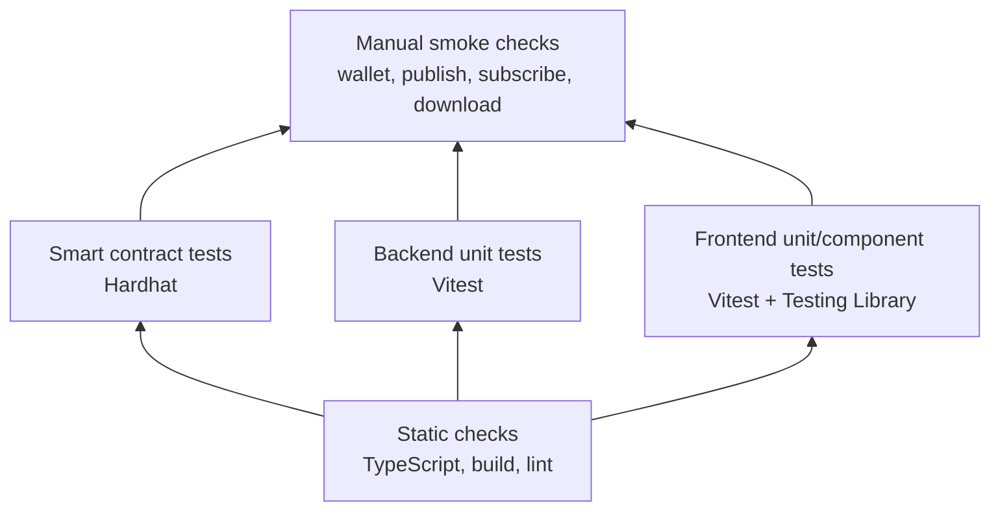

# Testing Strategy

Testing is split by layer: pure domain logic, frontend component behavior, backend services and smart contract behavior.



## Backend tests

Backend tests cover access evaluation, subscriptions, platform billing, posts, projects and activity-related behavior. The goal is to protect business rules such as:

- locked content must not leak;
- archived and draft content must not appear in public lists;
- subscription confirmation must verify on-chain events;
- quota checks must block uploads when storage limits are exceeded.

## Frontend tests

Frontend tests focus on component states, validation, error handling, session behavior, cards and formatting helpers.

## Smart contract tests

Hardhat tests cover:

- plan registration and update;
- ERC-20 and native subscription payment;
- platform fee split for reader subscriptions;
- platform billing amount calculation;
- paidUntil extension;
- owner-only administrative methods.

## Acceptance scenarios

```gherkin
Given a reader has an active entitlement
When protected content is requested
Then the backend returns unlocked content
```

```gherkin
Given a reader does not satisfy the required access policy
When protected content is requested
Then the backend returns a locked preview or access error
```

```gherkin
Given an author exceeds the current storage quota
When a new file upload is attempted
Then the backend rejects the upload with a quota error
```

## Verification commands

| Area | Command |
| --- | --- |
| Backend tests | `cd backend && npm test -- --run` |
| Frontend tests | `cd frontend && npm test -- --run` |
| Frontend build | `cd frontend && npm run build` |
| Smart contracts | `cd solidity && npx hardhat test` |
| Documentation build | `cd documentation && npm run docs:build` |

The commands intentionally target each workspace separately because the repository is not a single root package workspace.
