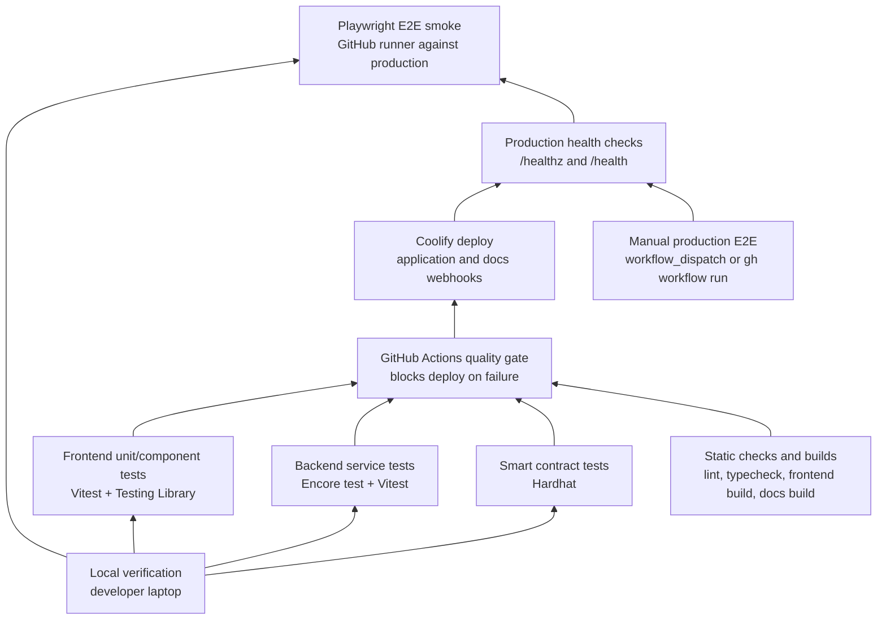

# Testing Strategy

Testing is organized as a deployment gate, not as a loose checklist. Fast deterministic checks run before any production deploy is triggered, while browser smoke tests run after Coolify has published the new version and the public health endpoints are reachable.



## Unit Tests

Unit and service tests protect the business rules before a build is allowed to reach Coolify.

| Layer | What is covered | Command |
| --- | --- | --- |
| Frontend | component states, validation, error rendering, session behavior, cards and formatting helpers | `cd frontend && npm test -- --run` |
| Backend | access evaluation, subscriptions, platform billing, posts, projects, activity, profile/avatar behavior | `cd backend && npm test` |
| Backend Encore runtime | service tests through Encore's test runner | `cd backend && encore test` |
| Smart contracts | plan registration, ERC-20/native subscription payment, platform fee split, paidUntil extension, owner-only methods | `cd solidity && npm test` |

The deployment workflow also runs `cd frontend && npm run lint`, `cd frontend && npm run build`, `cd backend && npx tsc -p tsconfig.json --noEmit`, and `cd documentation && npm run docs:build`. If any of these checks fail, the backend image is not pushed and Coolify webhooks are not called.

## E2E / Acceptance Tests

Playwright covers public acceptance smoke scenarios without requiring seed data or wallet signing in the first version.

| Mode | How it runs | Command |
| --- | --- | --- |
| Local E2E | Builds frontend, starts Vite preview on `127.0.0.1:4173`, then runs Playwright against that local URL. No production secrets are required. | `cd frontend && npm run e2e:install && npm run e2e` |
| Production E2E | Runs against `https://usecontent.app` after production health checks pass. Used by post-deploy and manual GitHub Actions workflows. | `cd frontend && npm run e2e:prod` |
| Manual production E2E | Starts from GitHub Actions `workflow_dispatch`, or from CLI via `gh workflow run e2e-production.yml`. It does not deploy a new version. | GitHub Actions UI or `gh workflow run` |

Current acceptance smoke scenarios:

```gherkin
Given the public application is deployed
When a visitor opens the homepage
Then the application shell renders without a runtime crash
```

```gherkin
Given the public discovery feed is available
When a visitor opens the feed
Then the page shows public cards, an empty state, or a recoverable error state
```

```gherkin
Given a public post contains previewable media
When a visitor opens the media tile
Then the lightbox dialog opens, keeps the download action visible, and closes with Escape
```

## Coverage

The current suite gives coverage across the critical deployment path:

- frontend unit/component behavior and production build regressions;
- backend business rules for access, content visibility, subscriptions, platform billing and projects;
- Solidity payment and fee logic through Hardhat;
- documentation build integrity;
- production availability smoke through frontend and backend health endpoints;
- public browser smoke for the app shell, feed rendering and media lightbox.

Intentional V1 gaps:

- wallet signing flows are not automated in Playwright yet;
- paid subscription happy paths are covered by backend/contract tests, not by browser E2E;
- production E2E is tolerant of missing public content and does not seed data;
- no browser visual-diff coverage is enabled yet.

These gaps are deliberate because the first E2E layer must run safely against production without private keys, seed endpoints or paid test wallets.

## Verification

Run these locally before pushing a risky change:

| Area | Command |
| --- | --- |
| Backend tests | `cd backend && npm test` |
| Backend Encore tests | `cd backend && encore test` |
| Backend typecheck | `cd backend && npx tsc -p tsconfig.json --noEmit` |
| Frontend lint | `cd frontend && npm run lint` |
| Frontend tests | `cd frontend && npm test -- --run` |
| Frontend build | `cd frontend && npm run build` |
| Frontend E2E local | `cd frontend && npm run e2e:install && npm run e2e` |
| Frontend E2E production | `cd frontend && npm run e2e:prod` |
| Smart contracts | `cd solidity && npm test` |
| Documentation build | `cd documentation && npm run docs:build` |

The repository is not a single root package workspace, so commands intentionally run inside each package directory.

In CI, `.github/workflows/deploy.yml` runs the quality gate before deploy, triggers Coolify only after the gate passes, waits for `https://usecontent.app/healthz` and `https://api.usecontent.app/health`, then runs the production Playwright smoke suite. `.github/workflows/e2e-production.yml` runs the same production smoke suite manually without deploying.
